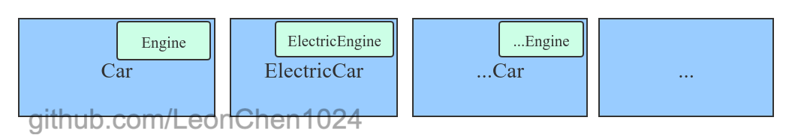
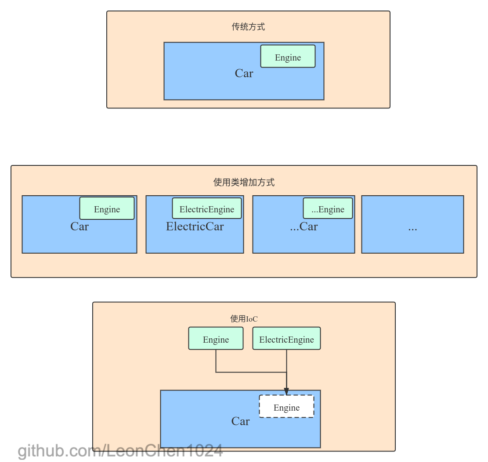

# IoC 控制反转

[TOC]

# 概述

**控制反转**（Inversion of Control，缩写为**IoC**）,它是软件开发中的一种设计原则,可以降低代码的耦合度,使得程序更加的模块化,更易于扩展.

为什么叫做控制反转?又为什么能够降低代码的耦合度呢?

在常规的开发过程中,很多时候一个类都是要依赖于其他的类才能实现某些功能,才能够更好的将关注点分离,比如一个车 `Car` 类 内部需要使用燃油引擎 `Engine` 类,那么他需要在 `Car` 的内部做类似 `new Engine()` 这样的操作, 看起来没有任何的问题,但是当需要更换引擎为他的子类电气引擎`ElectricEngine` 的时候,问题就来了,我们需要在 `Car` 的内部修改  `Engine`  类,或者是当 `Engine` 做了修改需要额外的参数的时候,也会需要改动到 `Car` 的内部,并且每个类都得对自身的依赖有更多的了解,这就违反了底米特原则(todo) 和 开闭原则(todo)导致了代码的耦合度极高,不利于维护和扩展.

如图

在这种情况下,类的依赖创建获得是由类本身来进行控制的,所以在变动时也只能由类本身来操作.控制反转就是将这个控制依赖获得的权力交给外部,这么做的效果是怎么样的呢?

这个时候我们将这个依赖创建获得的权利交给外部去维护,那么这个类只需要声明他需要一个 `Engine` 即可,至于是燃油还是电气的引擎就由外部控制,**这种由原来主动的控制创建依赖变为被动的接收注入的依赖对象,就是控制反转**,再碰到这样的问题的时候,就不需要更改 `Car` 内部的代码了.而是由外部代码控制即可.

如图

当然,你也可以说你再实现一个类,就叫 `ElectricCar` 然后再维护这个类就可以,但是这样因为某个元素变化就会导致类的层级和数量迅速膨胀,导致难以维护.一但依赖元素过多,就是导致无法控制的类数量.比如我再增加一个轮胎,轮胎也有2个种类,那么光是 `Engine` 和 `Tire` 组合就需要4个 `Car` 类来实现

如图

总对比图

# 实现方法

前面说了 IoC 的理念,但是这只是一个思想,并不是一个实现方法,那么我们要如何实现 IoC呢?一般情况下有这么几种方法

## 依赖注入(dependency injection)

顾名思义,也就是通过外部注入依赖到调用者,然后调用者就可以直接使用这个依赖了.这是控制反转中最常见的一种技术了.

依赖注入有如下实现方式:

- 手动注入. 不利于扩展,当程序不断庞大的时候,维护难度变高,并且需要维护大量的模板代码.
  - 基于接口.实现特定接口以供外部容器注入所依赖类型的对象.
  - 基于 set 方法.实现特定属性的 `set` 方法，来让外部容器注入所依赖类型的对象.
  - 基于构造函数.实现特定参数的构造函数，在新建对象时注入所依赖类型的对象.
- 自动注入. 便于维护,开发效率较高,代码清晰
  - 基于注解. 基于Java的注解功能(todo)，在私有变量前加 `@Autowired` 等注解，不需要显式的定义手动注入的那些代码，就可以让外部容器注入对应的对象.相当于定义了public的set方法，但是因为没有真正的set方法，减少了暴露的接口（使用set方法的话必须设置set方法为 public , 导致外部其他对象都可以显式随意的访问这个接口,但是这个依赖是否想要让外部访问修改还是个未知数.）

一般情况下使用 自动注入,注解注入的情况比较多.

[依赖注入详情点这里]()

## 依赖查找(dependency lookup)

这个方式一般情况下是作为依赖注入的一个补充,它主要是让类通过外部容器的接口来查找自己依赖的对象.方式更加主动,但是由于使用了容器的接口,所以无法在容器外使用,扩展性较低.

## 服务定位器模式(service locator pattern)

也是一种用于软件开发的设计模式,通过一个完备的抽象层服务中央注册表,提供了所有需要的依赖.

**优势**

- 允许运行时添加代码而不必重新编译.
- 可以在运行时有选择的从服务定位器添加和删除项目
- 完全解耦,程序之间的唯一连接就是注册表

**缺点**

- 注册表由于是直接在运行时使用的,所以有些异常无法在编译时发现.会出现运行时异常,比如找不到依赖项.
- 测试难度比较高.

## 使用模板方法设计模式

通过模板方法设计模式将实例化的过程放到调用者去实现,这个方式的缺点就是和手动注入一样比较麻烦

# 扩展

## 其他应用

不仅仅是这个,其实在回调,事件分发机制(todo),模板方法中都使用到了IoC 这个原则.

