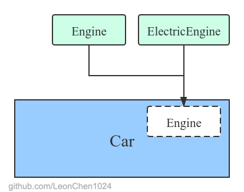
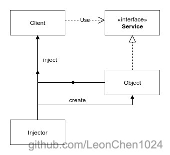

# 依赖注入

[TOC]

# 概述

依赖注入(Denpendecy Injection ,DI) 通常和 [控制反转(Inverse of Control,IoC)](https://github.com/LeonChen1024/Excellent-Javaer/blob/master/principle/ioc.md) 一起出现.它是实现IoC的主要手段之一.通过依赖注入类可以不关心自身的依赖应该如何构造,而是由注入器代理这个职责,将类需要的依赖构建好后注入到类里.可以达到分离关注点,分离调用方和依赖,提高可复用性和可维护性.

## 为什么需要依赖注入

**为什么需要依赖注入呢?** 这和为什么需要IoC的原因基本相同.

在常规的开发过程中,很多时候一个类都是要依赖于其他的类才能实现某些功能,才能够更好的将关注点分离,比如一个车 `Car` 类 内部需要使用燃油引擎 `Engine` 类,那么他需要在 `Car` 的内部做类似 `new Engine()` 这样的操作, 看起来没有任何的问题,但是当需要更换引擎为他的子类电气引擎`ElectricEngine` 的时候,问题就来了,我们需要在 `Car` 的内部修改  `Engine`  类,或者是当 `Engine` 做了修改需要额外的参数的时候,也会需要改动到 `Car` 的内部,并且每个类都得对自身的依赖有更多的了解,这就违反了底米特原则(todo) 和 开闭原则(todo)导致了代码的耦合度极高,不利于维护和扩展.

如图


这个时候我们将这个依赖创建获得的权利交给外部去维护,那么这个类只需要声明他需要一个 `Engine` 即可,至于是燃油还是电气的引擎就由外部控制,此时依赖不再是内部生成,而是通过外部注入得到,再碰到这样的问题的时候,就不需要更改 `Car` 内部的代码了.而是由外部代码控制即可.

如图



依赖注入尾为我们解决了以下问题:

- 如何让一个类和如何创建这个类互不关联
- 如何让类支持一定程度的可变性,提高可复用度
- 如何通过一些外部配置来控制对象的创建
- 如何让一个应用支持不同的配置

# 细节


## 组成结构

依赖注入将依赖的创建和依赖的行为隔离开,这使得程序变得更加松耦合并且更加符合依赖反转原则(todo)和单一职责原则(todo).

最完全的依赖注入包含以下几个部分

- 服务. 要使用的对象.
- 客户端. 依赖服务的对象.
- 接口. 定义客户端如何使用服务.
- 注入器. 构建服务并注入到客户端中.

UML图如下:




用前面的汽车的例子对应

- 服务. `Engine`, `ElectricEngine` 
- 客户端.   `Car`
- 接口. 比如 Engine 实现了一个 `IEngine` 接口, `Car` 内部使用 `IEngine` 前面的例子简化了这一步,我们可以看到像Spring 中使用的时候有时候也是会存在简化的情况.
- 注入器. 将`Engine` 注入到 `Car` 中的对象.

常见的简化是直接使用了父子类来替代接口进行操作,这个需要根据情况具体分析.当然,这么做势必会违反依赖倒置原则和影响解耦程度.所以最优的情况是按照要求完整的实现它.

客户端不应该知道具体的依赖实现,而是只关心接口,而接口后面的变化则不会对客户端产生任何影响.

注入器通常也有很多别的名称,比如 提供者,容器,工厂等


## 实现方式

依赖注入有如下实现方式:

- 手动注入. 不利于扩展,当程序不断庞大的时候,维护难度变高,并且需要维护大量的模板代码.
  - 基于接口.实现特定接口以供外部容器注入所依赖类型的对象.优点是依赖可以完全不了解客户端,都对接口负责即可.
  - 基于 set 方法.实现特定属性的 `set` 方法，来让外部容器注入所依赖类型的对象.灵活性较高,任何时候都可以修改,但是由于过于灵活,无法确保依赖的完整,而且在所需依赖较多的时候,调用者难以判断需要哪些依赖.是否注入完整.并且暴露了注入接口,可能被其他对象意外调用.
  - 基于构造函数.实现特定参数的构造函数，在新建对象时注入所依赖类型的对象. 使得依赖在刚创建对象的时候就被注入,保证了可靠性.但是灵活性较低,后面无法修改.
- 自动注入. 便于维护,开发效率较高,代码清晰
  - 基于注解. 基于Java的注解功能(todo)，在私有变量前加 `@Autowired` 等注解，不需要显式的定义手动注入的那些代码，就可以让外部容器注入对应的对象.相当于定义了public的set方法，但是因为没有真正的set方法，减少了暴露的接口（使用set方法的话必须设置set方法为 public , 导致外部其他对象都可以显式随意的访问这个接口,但是这个依赖是否想要让外部访问修改还是个未知数.）

一般情况下使用 自动注入,注解注入的情况比较多.

目前比如 Spring,Guice,Dagger 等框架都实现了依赖注入的功能.

### 代码示例

- 没有依赖注入的情况

```java
/** Client without DI */
  public class Client {
    // Internal reference to the service used by this client
    private ServiceImpl service;

    Client() {
      // Specify a specific implementation in the constructor instead of using dependency injection
      service = new ServiceImpl();
    }

    public void doSth() {
      service.doSth();
    }
  }
```


- 基于接口

```java
/** Client with interface DI */
  public class Client implements ServiceSetter {
    // Internal reference to the service used by this client
    private Service service;

    Client() {}

    public void doSth() {
      service.doSth();
    }

    @Override
    public void setService(Service service) {
      this.service = service;
    }
  }

  /** Service setter interface. */
  public interface ServiceSetter {
    void setService(Service service);
  }
```

​    

- 基于 set 方法

```java
/** Client with setter DI */
public class Client {
  // Internal reference to the service used by this client
  private Service service;

  Client() {}

  public void doSth() {
    service.doSth();
  }

    /**
    * set dependency in .
    */
  public void setService(Service service) {
    this.service = service;
  }
}
```


- 基于构造器

```java
/** Client with constructor DI */
public class Client {
  // Internal reference to the service used by this client
  private Service service;

  // set dependency with constructor
  Client(Service service) {
    this.service = service;
  }

  public void doSth() {
    service.doSth();
  }
}
```


- 基于注解

```java
/** Client with annotation DI */
public class Client {
  // Internal reference to the service used by this client
  @Inject
  private Service service;

  Client() {}

  public void doSth() {
    service.doSth();
  }
}
```

# 优点

- 提高了客户端的灵活性,使得代码的可配置性得到提高. 客户端只关注自己需要的接口行为,而不强行绑定接口背后的实现逻辑,使得实现逻辑在一定程度上可以改变而不影响到客户端.
- 使得应用可以同时适配多种情况,通过注入不同的对象实现不同的逻辑.程序灵活性大大提高,在测试等方面有显著的效果.
- 分离关注点.客户端不再关心依赖的创建和许多细节问题.这样更有利于单元测试等.
- 提高了代码的复用性,可测试性和可维护性.
- 减少了模板代码,将创建依赖都交给了注入器去管理.
- 更有利于协同开发.由于大家都只对接口负责,那么不同的模块也可以方便有效的交给不同的人开发.类似插件的开发方式
- 减少了客户端和依赖间的耦合
- 分离了类的使用和创建

# 缺点

- 如果没有使用合适的方法,会导致一些存在比较固定的默认对象的创建过程重复太多次,不利于维护.

- 提高了代码的学习成本,开发者必须了解DI的原理并且额外找到注入的对象才能理解这部分的逻辑.

- 提高了代码的使用难度.由于DI通常是通过反射或者APT技术实现的,所以对于IDE中的一些自动化操作会有所影响,比如 找到引用类,调用层级之类的.

- 提高了前期开发的成本.由于引入了DI技术,导致前期初始化依赖要做的事情变得复杂.虽然后期的维护成本将大大下降.

  

# About Me

我的博客 [leonchen1024.com](http://leonchen1024.com/)

我的 GitHub [https://github.com/LeonChen1024](https://github.com/LeonChen1024)

微信公众号 


